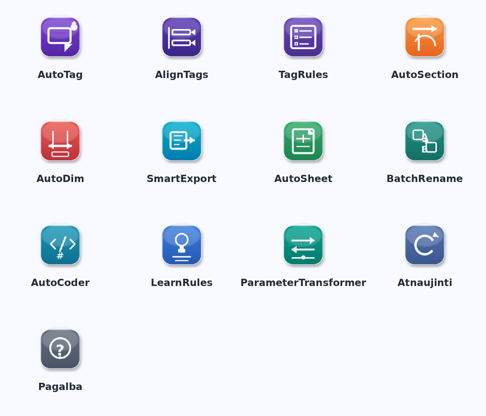

# Revit Tools ikonų peržiūra (v2)

> Šios piktogramos dar **neįdiegtos** į programą. Tai preview versija peržiūrai ir patvirtinimui.

## Bendras vaizdas

## Ikonos pagal įrankį

### AutoTag

- Idėja: tag žyma su „auto“ akcentu.
- Tikslas: aiškiai parodyti automatinį taginimą.

### AlignTags

- Idėja: keli tagai išlygiuoti pagal vieną ašį.
- Tikslas: momentiškai atpažįstamas lygiavimas.

### TagRules

- Idėja: taisyklių check-list.
- Tikslas: parodyti taisyklių valdymą.

### AutoSection

- Idėja: pjūvio linija su kryptimi.
- Tikslas: sekcijų generavimas.

### AutoDim

- Idėja: klasikinė dimensijos schema.
- Tikslas: aiškus matmenų automatizavimo simbolis.

### SmartExport

- Idėja: dokumento/duomenų „išėjimas“ rodykle.
- Tikslas: eksportavimo funkcija.

### AutoSheet

- Idėja: lapas su automatiniu sukūrimu.
- Tikslas: sheet kūrimas/generavimas.

### BatchRename

- Idėja: A → Z pervadinimo semantika.
- Tikslas: masinio pervadinimo indikacija.

### AutoCoder

- Idėja: kodavimo simboliai + #.
- Tikslas: NSIK kodavimo priskyrimas.

### LearnRules

- Idėja: „learning“ lemputė + taisyklių linijos.
- Tikslas: taisyklių mokymasis.

### ParameterTransformer

- Idėja: transformacijos kryptys + parametro juosta.
- Tikslas: parametrų keitimas/konvertavimas.

### Atnaujinti

- Idėja: refresh ciklas.
- Tikslas: atnaujinimo/reload mygtukas.

### Pagalba

- Idėja: aiškus klausimo simbolis.
- Tikslas: pagalbos/aprašų atidarymas.

## Failų vieta

- Preview aplankas: `projects/Revit_MEP_Tools/icon_redesign_preview_2026-04-22/`
- Aprašų failas: `projects/Revit_MEP_Tools/IKONU_APRASYMAI_PREVIEW.md`

## Po patvirtinimo

Patvirtinus pakeisiu aktyvius `icon.png` failus atitinkamuose `.pushbutton` kataloguose ir paruošiu atnaujintą paketą testavimui.
